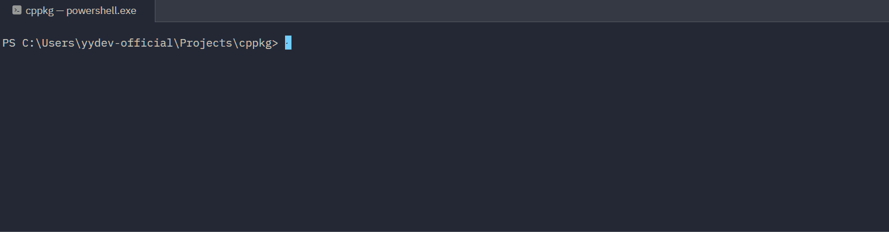
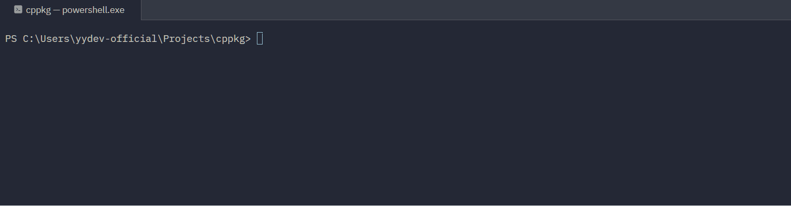
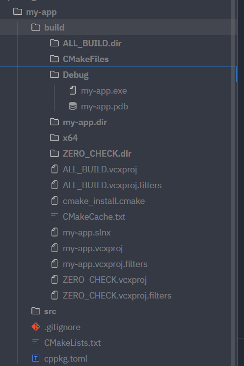

# cppkg

A package manager for C++ inspired by Cargo. Create, build, and manage C++ projects and workspaces from the command line.

## Installation

Clone the repo and build with CMake:

```powershell
git clone https://github.com/deform-labs/cppkg
cd cppkg
cmake -B build
cmake --build build
```

Then add the output directory to your PATH so you can run `cppkg` from anywhere.

## Demos


---



## Commands

### `cppkg init <name>`
Scaffold a new C++ package. If run inside a workspace, it automatically registers the package as a member.

```
cppkg init my-project
```

Creates:
```
my-project/
├── build/
├── src/
│   └── main.cpp
├── .gitignore
└── cppkg.toml
```

### `cppkg build [name]`
Build a package. Run from inside a package directory, or pass a path.

```
cppkg build         # build current directory
cppkg build my-project
```

Reads `cppkg.toml` for project metadata, generates a `CMakeLists.txt`, and compiles with MSVC.

### `cppkg add <package>@<version>`
Add a dependency to `cppkg.toml`.

```
cppkg add fmt@10.1.0
```

### `cppkg remove <package>`
Remove a dependency from `cppkg.toml`.

```
cppkg remove fmt
cppkg remove fmt@10.1.0
```

### `cppkg workspace init <name>`
Create a new workspace.

```
cppkg workspace init my-workspace
```

Creates:
```
my-workspace/
├── .gitignore
└── cppkg.toml
```

The `cppkg.toml` will contain a `[workspace]` section. Any package initialized inside this directory will be automatically added as a member.

### `cppkg help`
Show available commands.

```
cppkg help
```

## Package Manifest

`cppkg.toml` for a package:

```toml
[package]
name = "my-project"
version = "0.1.0"
cpp_std = "c++20"

[dependencies]
fmt = "10.1.0"
```

`cppkg.toml` for a workspace:

```toml
[workspace]
members = [
    "my-lib",
    "my-app",
]
```

## Workspaces

Workspaces group multiple packages under a single root. Initialize a workspace, then `cd` into it and run `cppkg init` to add members automatically.

```powershell
cppkg workspace init my-workspace
cd my-workspace
cppkg init my-lib
cppkg init my-app
```

The workspace `cppkg.toml` will be updated automatically:

```toml
[workspace]
members = [
    "my-lib",
    "my-app",
]
```

## License

MIT
